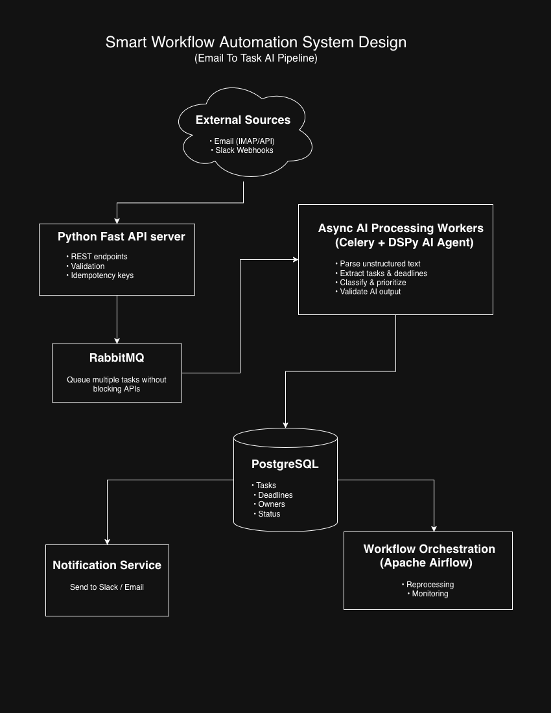

# Smart Workflow Automation
### Email-to-Task AI Pipeline

## Project Summary

Smart Workflow Automation is an AI-driven, event-based system that transforms unstructured business communications—such as emails and webhooks—into structured, actionable tasks. The platform automatically extracts tasks, deadlines, and stakeholders using LLM-powered AI agents and delivers real-time notifications to relevant teams.

Designed as a scalable, asynchronous pipeline, this project demonstrates how modern backend systems can integrate AI agents to reduce manual effort, minimize missed deadlines, and improve operational efficiency.

---

## Project Objective

The objective of this project is to automate task extraction and workflow coordination from unstructured communications, enabling teams to act faster and more accurately without manually processing inboxes or messages.

By combining asynchronous processing, AI agents, and workflow orchestration, the system provides a foundation for intelligent automation across emails, Slack messages, and other business inputs.

---

## Key Features

- **Automated Ingestion of Unstructured Data**
  Ingests emails and webhooks via FastAPI, validating and routing messages for asynchronous processing.

- **LLM-Powered Task Extraction**
  Uses DSPy-based AI agents to extract tasks, deadlines, priorities, and stakeholders from raw text.

- **Event-Driven Async Pipeline**
  Processes messages reliably using Celery and RabbitMQ to support high throughput and fault tolerance.

- **Structured Task Management & Notifications**
  Persists extracted tasks in PostgreSQL and notifies stakeholders via Slack, email, or webhooks in real time.

## Smart Workflow Automation System Design Diagram

---